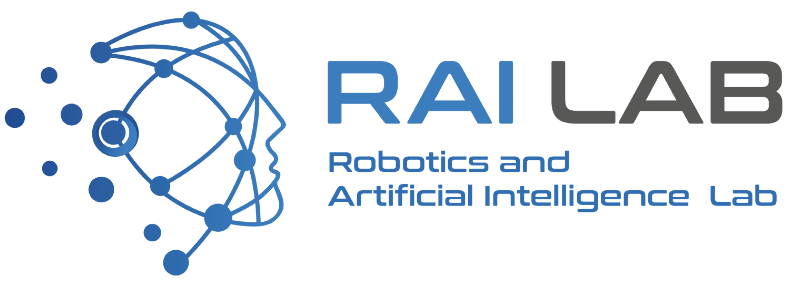

# 2023-RL-Seminar 

 

PyTorch Implementations of **deep reinforcement learning** algorithms

This repository will be updated every 2 weeks with new algorithm implementations.

## Paper List

1. [Human-level control through deep reinforcement learning](https://web.stanford.edu/class/psych209/Readings/MnihEtAlHassibis15NatureControlDeepRL.pdf)

2. [Prioritized Experience Replay](https://arxiv.org/pdf/1511.05952.pdf)

3. [Deep reinforcement learning with double q-learning](https://arxiv.org/pdf/1509.06461.pdf)

4. [Dueling Network Architectures for Deep Reinforcement Learning](https://arxiv.org/pdf/1511.06581.pdf)

5. [Unifying Count-Based Exploration and Intrinsic Motivation](https://arxiv.org/pdf/1606.01868.pdf)

6. [Deep Q-learning from Demonstrations](https://www.notion.so/Deep-Q-learning-from-Demonstrations-286cfedc31214d4f9da8f832129670f4)

7. [Trust Region Policy Optimization](https://arxiv.org/pdf/1502.05477.pdf)

8. [Proximal Policy Optimization Algorithms](https://arxiv.org/pdf/1707.06347.pdf)

9. [Continuous control with deep reinforcement learning](https://arxiv.org/pdf/1509.02971.pdf)

10. [Soft Actor-Critic: Off-Policy Maximum Entropy Deep Reinforcement Learning with a Stochastic Actor](https://arxiv.org/pdf/1801.01290.pdf)

11. [Addressing Function Approximation Error in Actor-Critic Methods](https://arxiv.org/pdf/1802.09477.pdf)

12. [Off-Policy Deep Reinforcement Learning without Exploration](https://arxiv.org/pdf/1812.02900.pdf)

## Installation

### Requirements

- [Pytorch](https://pytorch.org/)
- [Gymnasium](https://github.com/Farama-Foundation/Gymnasium)
- [MuJoCo](https://mujoco.org/)

- [Anaconda](https://www.anaconda.com/)

### Environment Setup

If it is already installed, you may skip the command below.

~~~shell
$ conda create -n conda_seminar python=3.8
$ conda activate conda_seminar
$ pip install gymnasium
$ conda install pytorch torchvision torchaudio -c pytorch
~~~

 ### Python PATH

You must specify **PYTHONPATH** to use the files in the src directory.

`export PYTHONPATH="(2023-RL-Seminar abs path):$PYTHONPATH" ` 

For example, on my setting,

`export PYTHONPATH="/Users/jindaejong/2023-RL-Seminar:$PYTHONPATH"`

## Usage

1. DQN with CartPole

   ~~~shell
   $ cd tests
   $ python 00_DQN_cartpole.py
   ~~~

[TODO]