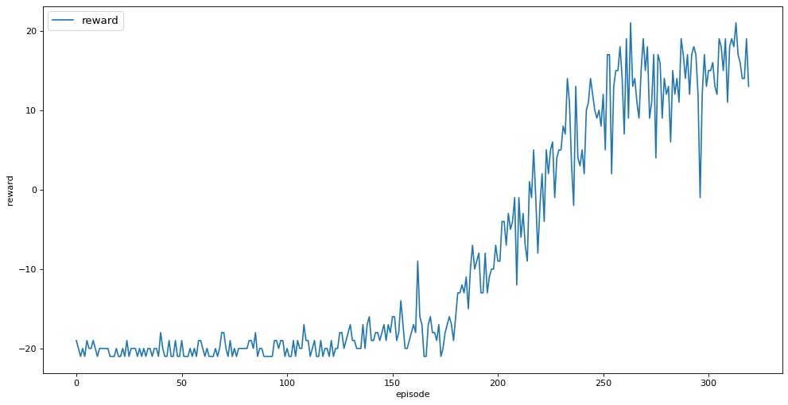
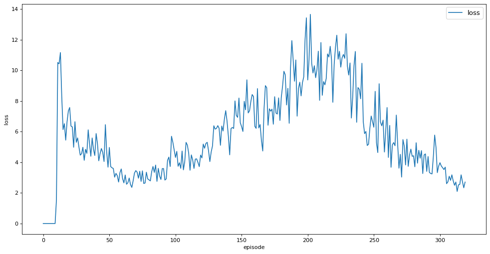

# 2023-RL-Seminar

PyTorch Implementations of **deep reinforcement learning** algorithms

It is designed so that you can easily run examples or add algorithms.

## Paper List

1. [~~Human-level control through deep reinforcement learning~~](https://web.stanford.edu/class/psych209/Readings/MnihEtAlHassibis15NatureControlDeepRL.pdf)
2. [~~Prioritized Experience Replay~~](https://arxiv.org/pdf/1511.05952.pdf)
3. [~~Deep reinforcement learning with double q-learning~~](https://arxiv.org/pdf/1509.06461.pdf)
4. [Dueling Network Architectures for Deep Reinforcement Learning](https://arxiv.org/pdf/1511.06581.pdf)
5. [Unifying Count-Based Exploration and Intrinsic Motivation](https://arxiv.org/pdf/1606.01868.pdf)
6. [Deep Q-learning from Demonstrations](https://arxiv.org/pdf/1704.03732.pdf)
7. [Trust Region Policy Optimization](https://arxiv.org/pdf/1502.05477.pdf)
8. [Proximal Policy Optimization Algorithms](https://arxiv.org/pdf/1707.06347.pdf)
9. [Continuous control with deep reinforcement learning](https://arxiv.org/pdf/1509.02971.pdf)
10. [Soft Actor-Critic: Off-Policy Maximum Entropy Deep Reinforcement Learning with a Stochastic Actor](https://arxiv.org/pdf/1801.01290.pdf)
11. [Addressing Function Approximation Error in Actor-Critic Methods](https://arxiv.org/pdf/1802.09477.pdf)
12. [Off-Policy Deep Reinforcement Learning without Exploration](https://arxiv.org/pdf/1812.02900.pdf)

## Installation

### Requirements

- [Pytorch](https://pytorch.org/)
- [Gymnasium](https://github.com/Farama-Foundation/Gymnasium)
- [MuJoCo](https://mujoco.org/)
- [Anaconda](https://www.anaconda.com/)

### Environment Setup

If it is already installed, you may skip the command below.

```
$ conda create -n conda_seminar python=3.8
$ conda activate conda_seminar
$ pip install gymnasium
$ conda install pytorch torchvision torchaudio -c pytorch
$ pip install gymnasium[atari]
$ pip install gymnasium[accept-rom-license]
```

- Trouble Shooting
  
    When you run `pip install gymnasium[accept-rom-license]`, the following text appears for a long time, and eventually installation may not work.
    
    ```bash
    Using cached libtorrent-2.0.7-cp38-cp38-manylinux_2_12_x86_64.manylinux2010_x86_64.whl (8.6 MB)
    Building wheels for collected packages: AutoROM.accept-rom-license
      Building wheel for AutoROM.accept-rom-license (PEP 517)
    ```
    
    Just enter the command below and you're done!
    
    `pip install --trusted-host [pypi.org](http://pypi.org/) --trusted-host [pypi.python.org](http://pypi.python.org/) --trusted-host [files.pythonhosted.org](http://files.pythonhosted.org/) autorom==0.5.5`
    

### Setup Python PATH

You must specify **PYTHONPATH** to use the files in the src directory.

```
export PYTHONPATH="(2023-RL-Seminar abs path):$PYTHONPATH"
```

For example, on my setting,

```
export PYTHONPATH="/Users/jindaejong/2023-RL-Seminar:$PYTHONPATH"
```

## Usage

1. DQN with Cartpole or Atari
   
    ```bash
    $ cd tests
    $ python 01_DQN_cartpole.py
    # or
    $ python 01_DQN_atari.py
    ```
    
2. Evaluate trained agent
   
    ```bash
    $ cd tests
    $ python evaluate.py -e CartPole-v1 -a DQN -c tests/result/DQN/cartpole/$(YOUR CHECK POINT NAME)
    # or
    $ python evaluate.py -e PongNoFrameskip-v4 -a DQN -c tests/result/DQN/atari/$(YOUR CHECK POINT NAME)
    # If you want to save video, add -s directory name
    $ python evaluate.py -e PongNoFrameskip-v4 -a DQN -c tests/result/DQN/atari/$(YOUR CHECK POINT NAME) -s videos
    ```
    

## Result

- Render video  

  

---

- Total Reward

  


---

- Loss

  